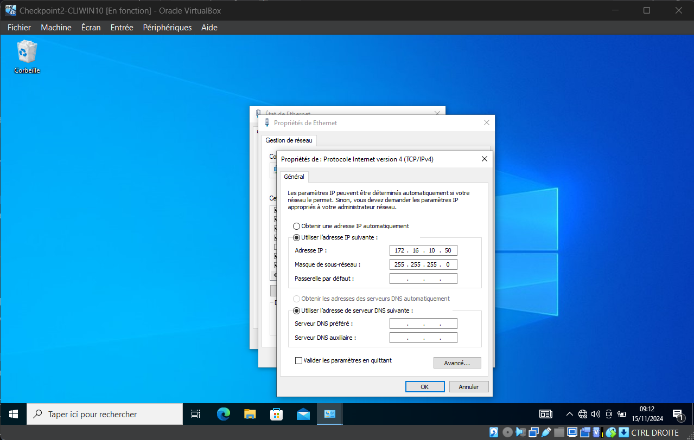
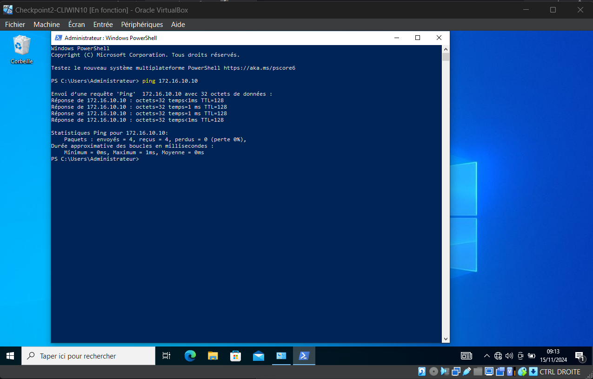
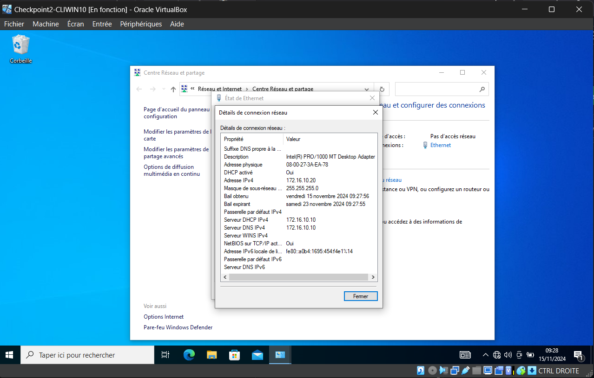
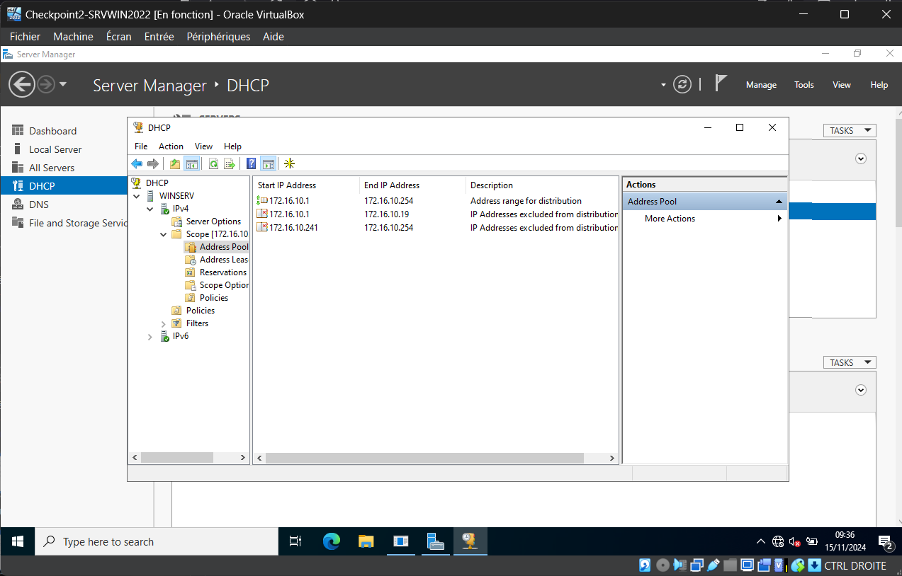
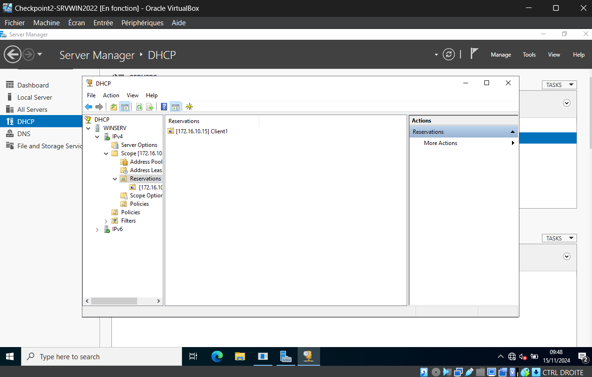
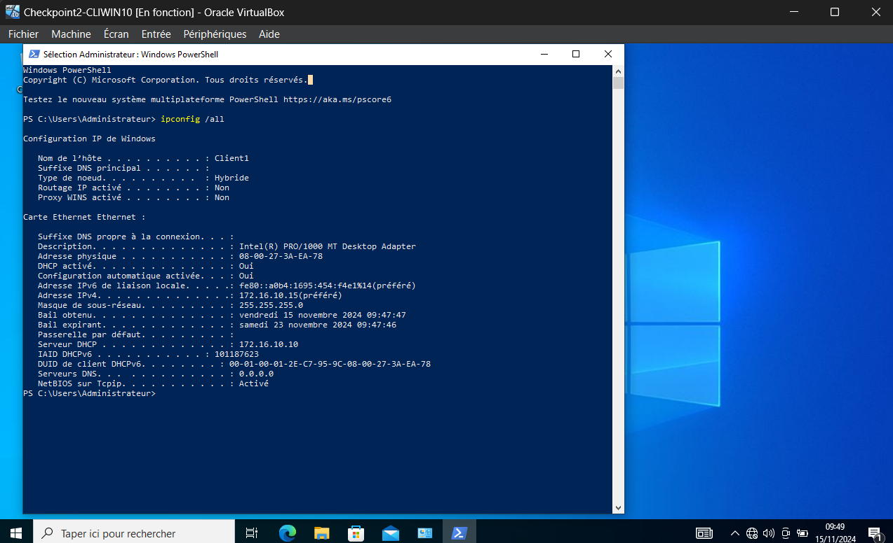

#### Exercice 1
  - Question 1.1 :  
    * Pour que les machines puissent communiquer entre elles, il faut qu'elles soient sur le même réseau.
Il faut donc modifier l'adresse réseau statique de la machine cliente en la passant de ````172.16.100.50/24```` vers ````172.16.10.50/24````




  - Question 1.3 :
    * En DHCP, l'adresse IP attribuée à la machine cliente est ````172.16.10.20````  
L'adresse attribuée correspond à la première disponible après la plage d'exclusion ````172.16.10.1 - 172.16.10.19````    



  - Question 1.4 :
    * La machine cliente peut avoir l'IP ````172.16.10.15````, il suffit de lui réserver l'adresse statique sur le serveur DHCP



#### Exercice 2
  - Question 2.1 :
    * voir le fichier Main.ps1
  - Question 2.2 à 2.11 :
    * voir le fichier AddLocalUsers.ps1
